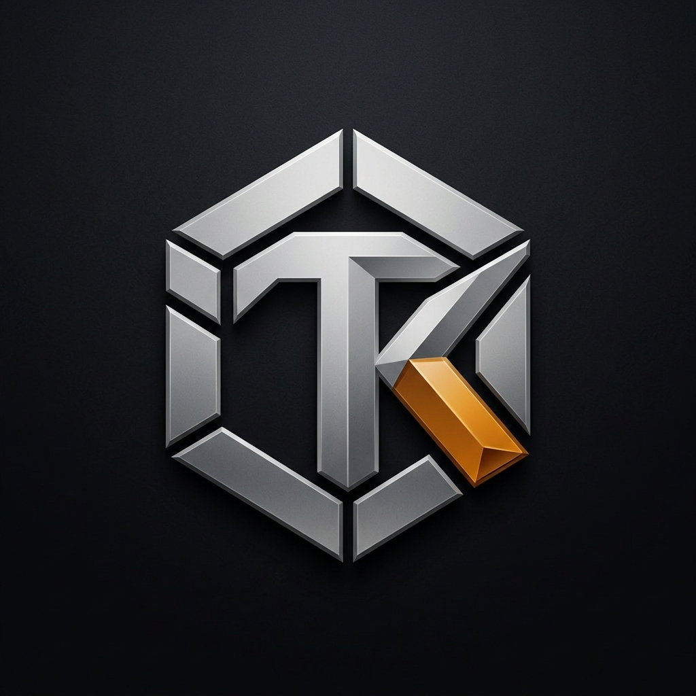

<p align="center">
  
</p>

<h1 align="center">TasteKit — TK-design.md</h1>

<p align="center">
  <strong>The Next-Generation DESIGN.md Engine, Live Token Studio & AI Coding Agent Ecosystem.</strong>
</p>

<p align="center">
  <a href="https://github.com/TasteKit/TK-design.md"></a>
  <a href="https://github.com/TasteKit/TK-design.md"></a>
  <a href="https://github.com/TasteKit/TK-design.md"></a>
  <a href="https://github.com/TasteKit/TK-design.md"></a>
</p>

---

## ⚡ What is TasteKit?

While tools like `getdesign.md` provide static markdown text, **TasteKit (`TK-design.md`)** is a dynamic, interactive design system platform and generator built specifically to **eliminate the AI taste gap**.

When AI coding assistants (Antigravity, Claude Code, Cursor, Codex) generate frontends, they often default to repetitive, clichéd templates. **TasteKit provides machine-readable, battle-tested design system profiles (`DESIGN.md`)** for over 75+ top websites and brands that give your agent deep aesthetic context: semantic color palettes, strict typography scales, responsive layout tokens, and explicit anti-pattern guardrails.

---

## 🌟 Key Features

* 🚀 **75+ Curated Design Systems**: Complete specs for Linear, Stripe, Apple, Vercel, Supabase, Raycast, Claude, Cursor, Airbnb, Teenage Engineering, Ferrari, BMW, OpenAI, Warp, and more!
* 🔮 **Interactive Live Playground**: Real-time canvas testing with live tokens applied directly to headers, hero banners, metrics cards, form inputs, and buttons.
* 🛡️ **WCAG 2.1 Contrast Validator**: Live compliance badge checking text-to-background contrast ratios.
* 🧩 **UI Primitives Sandbox**: Instant copy-paste HTML/JSX component snippets for buttons, badges, inputs, and cards.
* 🎨 **Visual Custom Studio**: Customize color layers, typography scales, radii, and anti-patterns with instant live sync.
* 🤖 **AI Token Extractor / URL Analyzer**: Reverse-engineer any website URL or aesthetic concept into a structured `DESIGN.md` spec.
* 📦 **Multi-Format Export**: One-click exports to `DESIGN.md`, `tailwind.config.js`, `variables.css`, and AI Agent rules (`AGENTS.md` / `.cursorrules` / `CLAUDE.md`).

---

## 🚀 Quick Start

### 1. Run the Studio Locally
```bash
# Clone the repository
git clone https://github.com/TasteKit/TK-design.md.git
cd TK-design.md

# Install dependencies
npm install

# Start the interactive development server
npm run dev
```

### 2. Use a DESIGN.md with your AI Agent
1. Choose or generate a spec in the TasteKit Studio (or grab any file from `design-specs/`).
2. Click **Export Spec** and copy or download `DESIGN.md`.
3. Drop `DESIGN.md` in the root of your project workspace.
4. Prompt your AI Agent:
   ```text
   Build the user settings page according to the design system rules in DESIGN.md.
   ```

---

## 📂 Repository Structure

```
TK-design.md/
├── design-specs/               # 75+ Raw Standalone DESIGN.md files
│   ├── linear.md
│   ├── stripe.md
│   ├── apple.md
│   ├── claude.md
│   ├── cursor.md
│   ├── vercel.md
│   ├── supabase.md
│   └── ... (70+ more)
├── src/
│   ├── data/
│   │   ├── allDesignSystems.json # Compiled 75+ token registry
│   │   └── designSystems.js
│   ├── components/
│   │   ├── BrandLogos.jsx      # Pixel-perfect SVG brand vectors
│   │   ├── Header.jsx          # Brand nav & quick actions
│   │   ├── Catalog.jsx         # Searchable grid & dense table showcase
│   │   ├── Playground.jsx      # Live interactive canvas & token inspector
│   │   ├── Studio.jsx          # Visual design system builder
│   │   ├── UrlAnalyzer.jsx     # AI website reverse-engineering extractor
│   │   └── ExportModal.jsx     # Multi-format export dialog with copy toasts
│   ├── utils/
│   │   ├── contrast.js         # WCAG contrast calculator
│   │   └── exporters.js        # Multi-format generators (DESIGN.md, Tailwind, CSS)
│   ├── index.css               # Minimalist Vanilla CSS design system
│   └── App.jsx                 # Master application controller
├── DESIGN.md                   # TasteKit Flagship Master Design Specification
└── README.md
```

---

## 🤝 Contributing

We welcome contributions of new design system analyses!
1. Fork this repository.
2. Add your design spec into `design-specs/` and `src/data/allDesignSystems.json`.
3. Test it in the Live Playground (`npm run dev`).
4. Submit a Pull Request.

---

## 📄 License

MIT License © 2026 [TasteKit](https://github.com/TasteKit).
